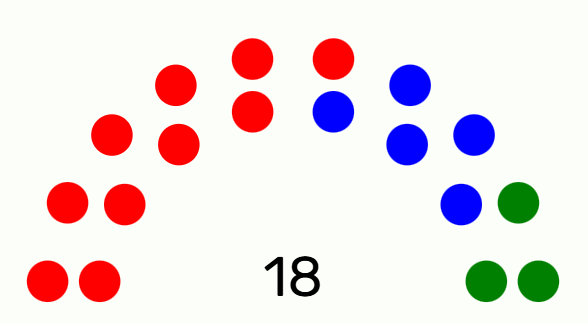

# Parliament Graph

React Component for Parliament Graph

```bash
npm i parliament-graph
```

## Example



```tsx
import ParliamentArch from "parliament-graph";

export default Component() {
    let candidacies = [
        { color: "red", seats: 10 },
        { color: "blue", seats: 5 },
        { color: "green", seats: 3 }
    ]
    return <ParliamentGraph candidacies={candidacies}/>
}

```
